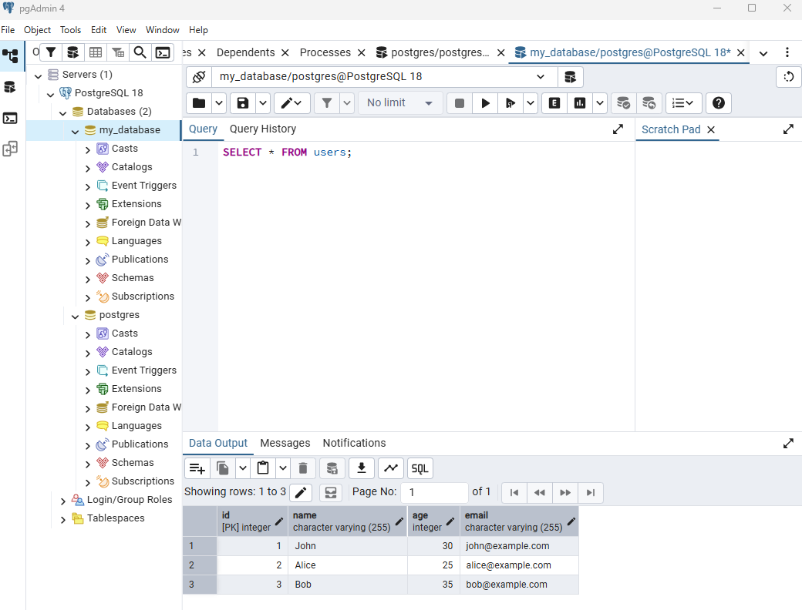
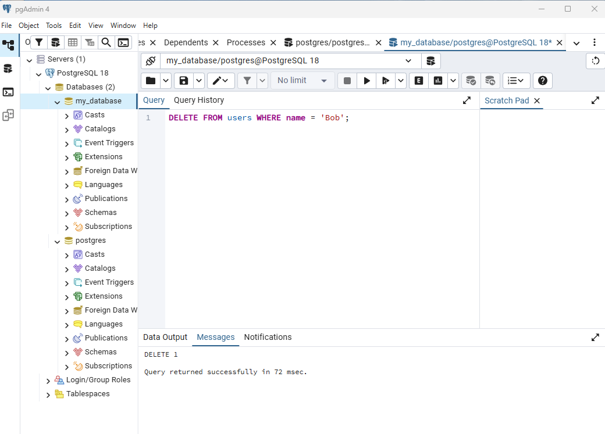
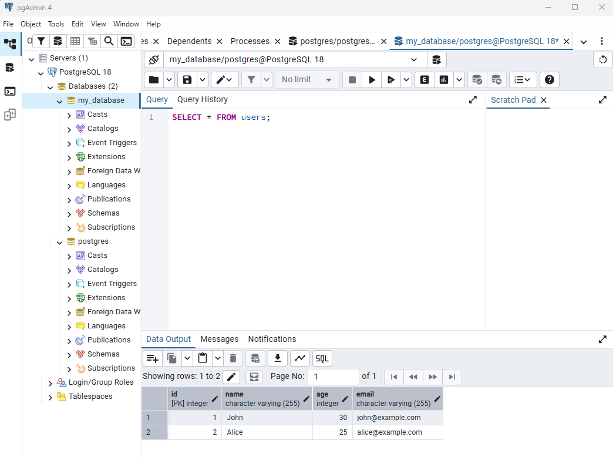

# База даних PostgreSQL 

## Створення бази даних **my_database**:
CREATE DATABASE my_database;

## Створення таблиці **users** :
CREATE TABLE users (
    id SERIAL PRIMARY KEY, -- В PostgreSQL вместо AUTO_INCREMENT используется тип SERIAL
    name VARCHAR(255) NOT NULL,
    age INT,
    email VARCHAR(255)
);

## Вставка значень в таблицю:
INSERT INTO users (name, age, email) VALUES 
('John', 30, 'john@example.com'),
('Alice', 25, 'alice@example.com'),
('Bob', 35, 'bob@example.com');

## Запит до всіх значень таблиці **users** :
SELECT * FROM users;

## Видалення з таблиці **users** строки де значення **name** дорівнює **'Bob'** :
DELETE FROM users WHERE name = 'Bob';

## Перевірка, чи видалено, знов запит до всіх значень таблиці:
SELECT * FROM users;
